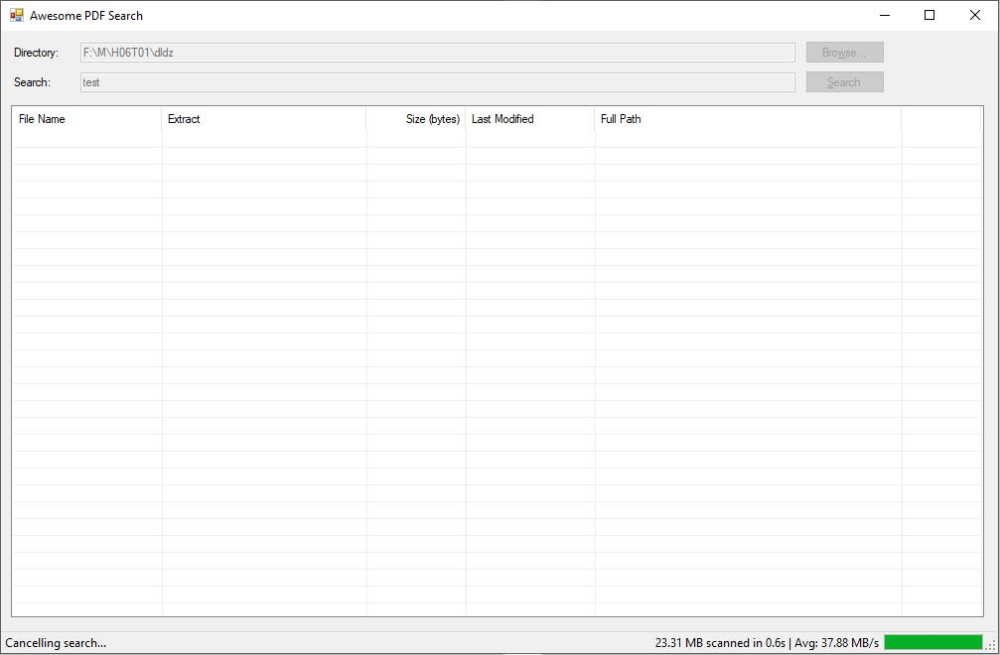

# AwesomePDFSearch

A fast, lightweight Windows desktop app that searches for text inside PDF files across entire directory trees.


## What It Does

Point it at a folder, type a search term, and it scans every PDF recursively — showing matching files with a text extract around the hit. Results are sortable, and you can open any PDF directly from the list.

## Features

- **Recursive PDF search** — scans all subdirectories
- **Context extracts** — shows surrounding text around each match
- **Real-time progress** — live stats: files scanned, MB/s throughput, elapsed time
- **Sortable results** — click any column header to sort by name, size, date, or path
- **Search history** — autocomplete for both directories and search terms, persisted across sessions
- **One-click open** — open any matched PDF directly from the results list
- **Cancel anytime** — press ESC to abort a long-running search
- **Background processing** — UI stays responsive during search

## Screenshot



## Requirements

- Windows 10 or later
- .NET Framework 4.8.1

## Building

```
rebuild.cmd
```

The script checks for .NET Framework build tools and restores NuGet packages before building.

## Dependencies

| Package | Version | Purpose |
|---------|---------|---------|
| [iTextSharp](https://www.nuget.org/packages/iTextSharp/) | 5.5.13.4 | PDF text extraction |
| [BouncyCastle.Cryptography](https://www.nuget.org/packages/BouncyCastle.Cryptography/) | 2.4.0 | Required by iTextSharp |

## How It Works

1. Enumerates all `.pdf` files under the chosen directory
2. Opens each PDF with iTextSharp and extracts text page by page
3. Performs case-insensitive search on the extracted text
4. Returns the first match per file with ~150 characters of context
5. Displays results in a sortable ListView with file metadata

---

**Keywords:** PDF search, full-text search PDF, search inside PDF files, PDF text search tool, Windows PDF searcher, find text in PDF, bulk PDF search, PDF grep, desktop PDF search utility, C# PDF search, iTextSharp search, recursive PDF search
